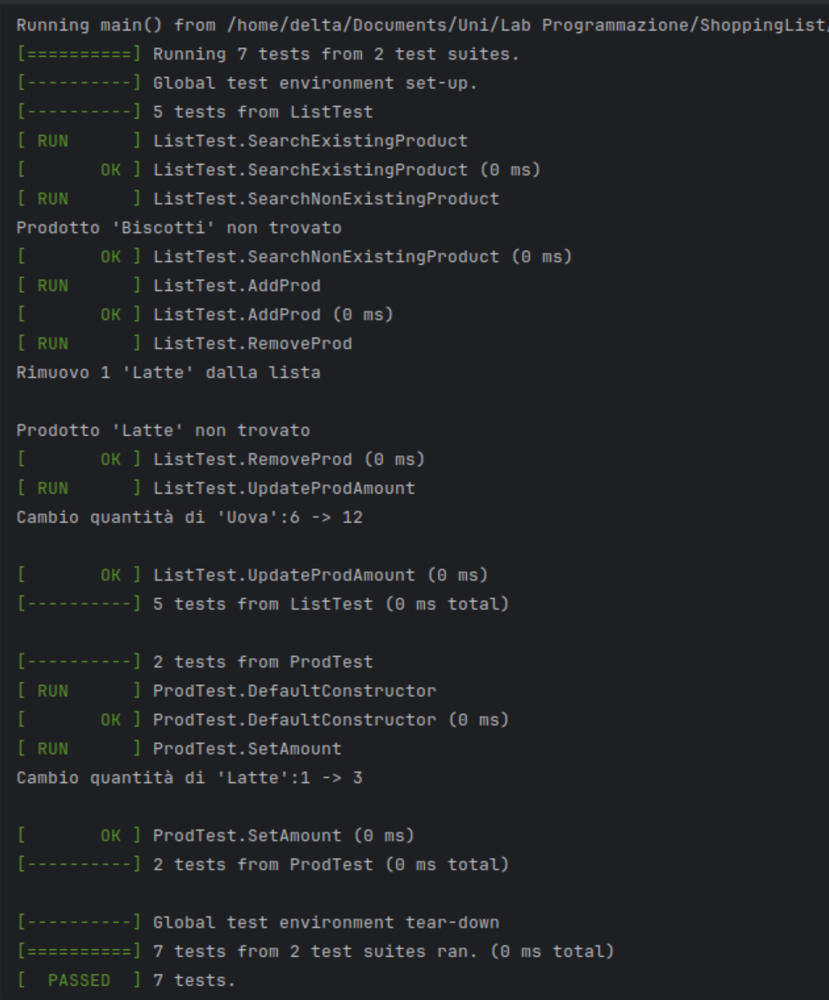

# ShoppingList
A C++ project for a shopping list.

You can create a shopping list, add items to it, remove items from it, and edit amounts of items in it.

- [x] Shopping list functions
  - [x] Search and add
  - [x] Add by name
- [x] GTest unit tests
  - [x] List tests
  - [x] Item tests
- [x] Graphical interface
  - [x] Buttons
  - [x] Text fields

  
   
  

